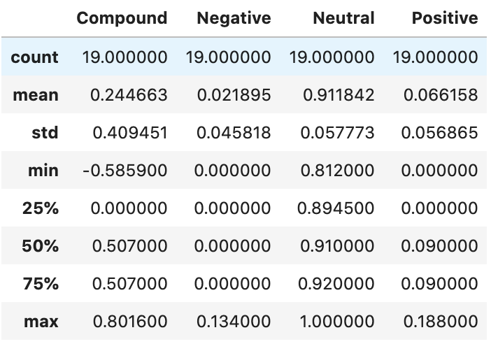
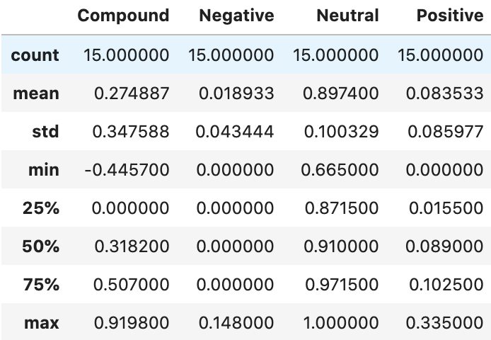
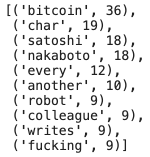
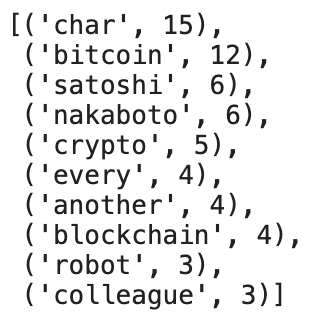
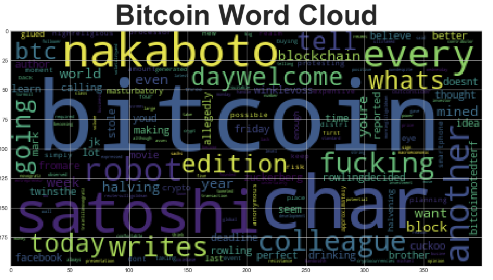
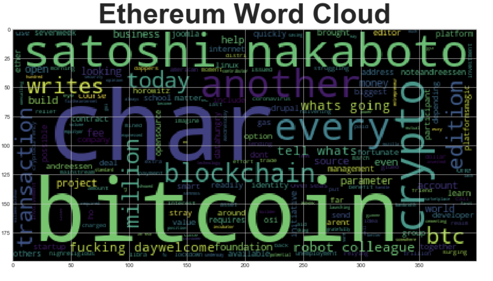
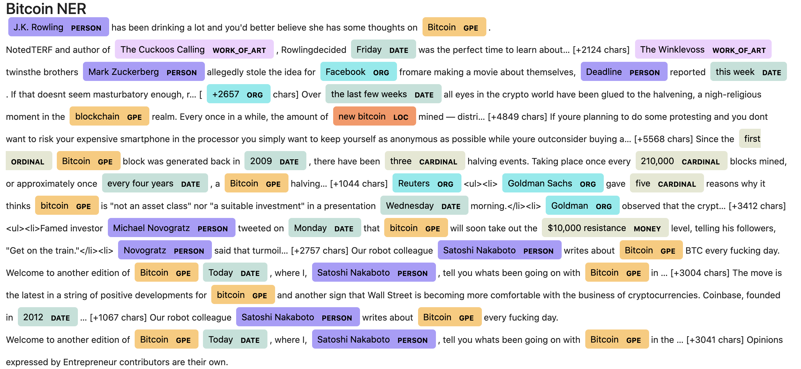
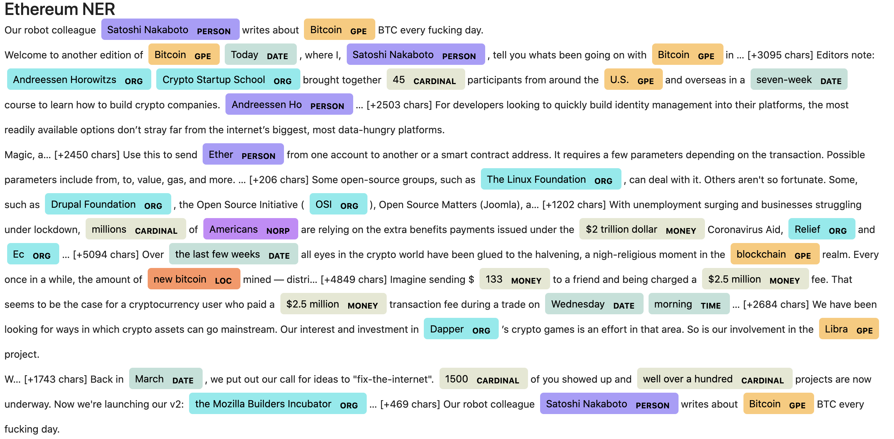

# Crypto Sentimental Analysis - Natural Language Processing


## Background

There's been a lot of hype in the news lately about cryptocurrency, so you want to take stock, so to speak, of the latest news headlines regarding Bitcoin and Ethereum to get a better feel for the current public sentiment around each coin.

Using natural language processing(NLP) to understand the sentiment in the latest news articles featuring `Bitcoin` and `Ethereum`. By applying fundamental NLP techniques to better understand the other factors involved with the coin prices such as common words and phrases and organizations and entities mentioned in the articles.

### Package Used:

1. [Sentiment Analysis](#Sentiment-Analysis) 
    
    - [Vader Sentiment Analysis](http://www.nltk.org/howto/sentiment.html)
  
  
2. [Natural Language Processing](#Natural-Language-Processing) - Natural Language Toolkit - [NTLK](https://www.nltk.org/)
    
    - Tokenizing Words & Sentences - [Tokenizing](https://www.nltk.org/api/nltk.tokenize.html)
    - Generate N-Grams - [Ngrams](https://kite.com/python/docs/nltk.ngrams)
    - Word Cloud - [WordCloud](http://amueller.github.io/word_cloud/)
    
    
3. [Named Entity Recognition](#Named-Entity-Recognition) - [spaCy](https://spacy.io/)

    - Named Entity Recognition - [NER](https://spacy.io/usage/visualizers#ent)
    - Visualizers - [Displacy](https://spacy.io/usage/visualizers)
    
    <br/>
- - -

### Files

[Starter Notebook](Starter_Code/crypto_sentiment.ipynb)

- - -

### Crypto Sentimental Analysis

<details>
<summary> <strong>Sentiment Analysis</strong> </summary><br>

1. Use the [newsapi](https://newsapi.org/) to pull the latest news articles for `Bitcoin` and `Ethereum` and create a DataFrame of sentiment scores for each coin

    ```python
    # Create a newsapi client
    newsapi = NewsApiClient(api_key=api_key)
    btc_articles = newsapi.get_everything(q='bitcoin',
                                          language='en',
                                          sort_by='relevancy')
    ```
2. **`Descriptive statistics`**

Bitcoin         |  Ethereum 
:----------------:|:----------------
 |


3. **`Sentiment Score Analysis`**
    
Using the above metrics to answer the following:

> Which coin had the highest mean positive score?
> ```python
>   Ethereum - 0.083533
> ```
> Which coin had the highest negative score?
> ```python
>   Ethereum - 0.919800
> ```
> Which coin had the highest positive score?
> ```python
>   Ethereum - 0.335000
> ```
  
    
    
</details>

<details>
<summary> <strong>Natural Language Processing</strong> </summary><br>

1. **`Tokenization`**

    1. `Importing the required libraries from NLTK`

        ```python
        from nltk.tokenize import word_tokenize, sent_tokenize
        from nltk.corpus import stopwords
        from nltk.stem import WordNetLemmatizer, PorterStemmer
        from string import punctuation
        import re
        ```
        
    2. `Using NLTK and Python to tokenize the text for each coin`
    
        * Remove punctuation
    
        ```python
            # Remove the punctuation
            regex = re.compile("[^a-zA-Z0-9 ]")
            re_clean = regex.sub('', text)
        ```
        * Lowercase each word and tokenize it
        
        ```python
            # Create a list of the words
            words = word_tokenize(re_clean.lower())
        ```
        * Remove stop words
        
        ```python
            # Convert the words to lowercase and Remove the stop words
            words = [word for word in words if word not in stop_words]
        ```
        * Lemmatize Words into Root words (eg: get = gets, got, getting)
        
        ```python
            # Lemmatize Words into root words
            root_words = [lemmatizer.lemmatize(word) for word in words]
        ```
   
2. **`Produce Ngrams and word frequency`**
    
    * Produce the ngrams for two words (N=2)
    ```python
        def bigram_counter(tokens, N=2): 
            words_count = dict(Counter(ngrams(tokens, n=N)))
            return words_count
    ```
    
    * List the top 10 words for each coin
    
    Bitcoin         |  Ethereum 
    :----------------:|:----------------
      |

  
  
3. **`Generate word clouds for each coin to summarize the news for each coin`**
    
    ```python
        from wordcloud import WordCloud
        import matplotlib.pyplot as plt
        import matplotlib as mpl

        plt.style.use('seaborn-whitegrid')
        mpl.rcParams['figure.figsize'] = [15.0, 10.0]

        wc = WordCloud(collocations=False).generate(' '.join(btc_tokens))
        plt.title(label='Bitcoin Word Cloud', 
                  fontdict={'fontsize': 50, 'fontweight':'bold'})
        plt.imshow(wc)
    ```
    

    



</details>

<details>
<summary> <strong>Named Entity Recognition</strong></summary><br>


Here we build a named `entity recognition model` for both coins and visualize the tags using SpaCy.

1. **`Importing the required libraries from NLTK`**

    ```python
        import spacy
        from spacy import displacy
        import re

        # Load the spaCy model
        nlp = spacy.load('en_core_web_sm')
    ```

2. **`Run a named entity recognition model for both coins`**
    
    ```python
        # Run the NER processor on all of the text
        doc= nlp(btc_content)

        # Add a title to the document
        doc.user_data["title"] = "Bitcoin NER"
    ```

3. **`Visualize the tags using SpaCy`**
    
    ```python
        # Render the visualization
        displacy.render(doc, style='ent')
    ```






4. **`List all Entities`**

    ```python
        for ent in doc.ents:
            print('{} {}'.format(ent.text, ent.label_))
    ```

    ```
        J.K. Rowling PERSON
        Bitcoin GPE
        The Cuckoos Calling WORK_OF_ART
        Friday DATE
        The Winklevoss WORK_OF_ART
        Mark Zuckerberg PERSON
        Facebook ORG
        Deadline PERSON
        this week DATE
        +2657 ORG
        the last few weeks DATE
        blockchain GPE
        new bitcoin LOC
        first ORDINAL
        Bitcoin GPE
        2009 DATE
        three CARDINAL
        210,000 CARDINAL
        every four years DATE
        Bitcoin GPE
    ```
</details>
